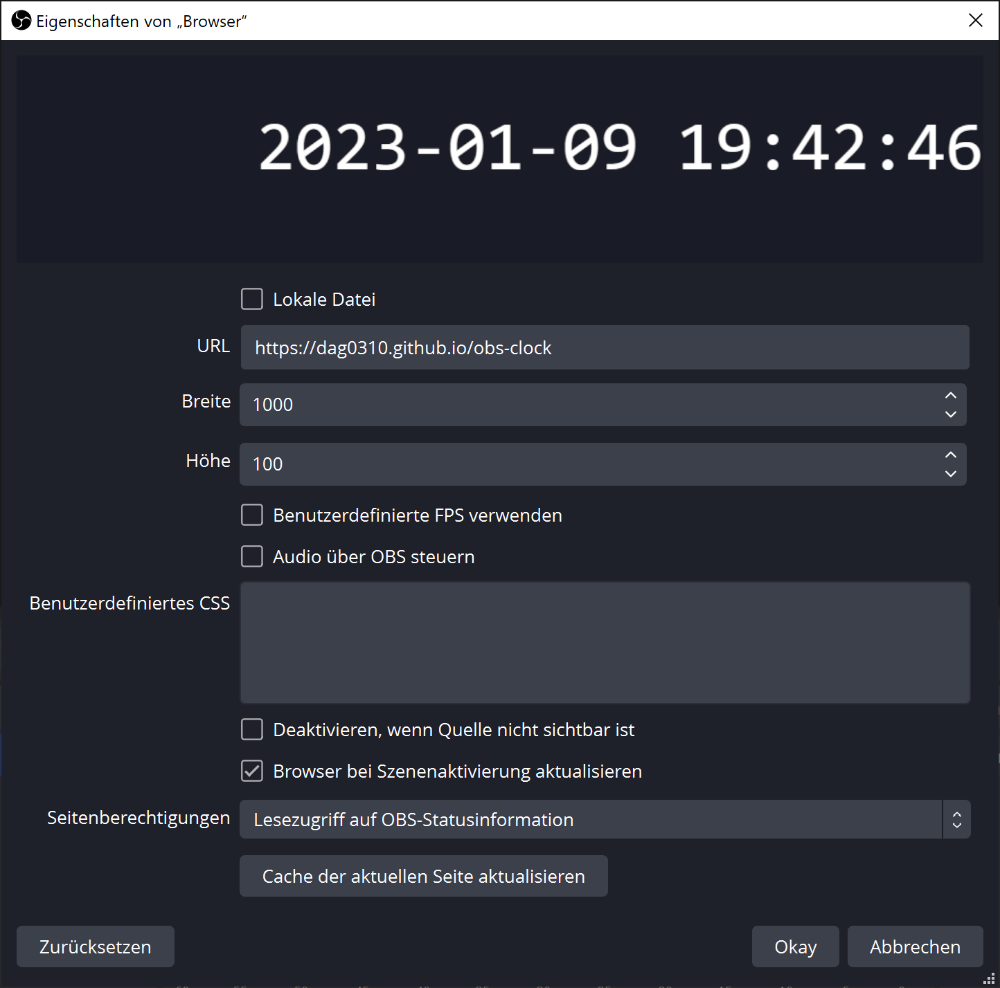

# OBS clock - Browser source

This is a simple client-side clock, so it will always show the time according to the timezone set on the client computer.

## How to

- Open [OBS](https://obsproject.com/)
- Add a new **Source** and select **Browser**
- Select the default `Add new source` and click `Okay`

- Select the `index.html` file either by downloading it from this repository or using the GitHub hosted URL
- Set width to `1000` and height to `100`
- Remove the custom CSS or overwrite it with your own style
- Click `Okay` and the clock should appear and you can position it as you want
